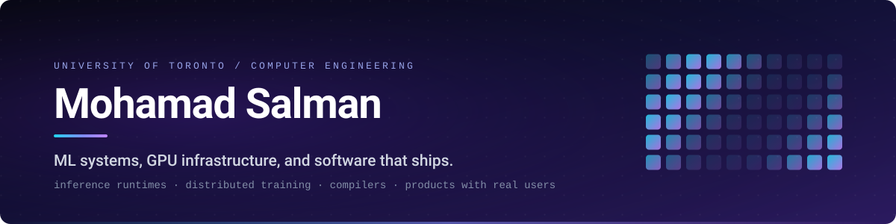
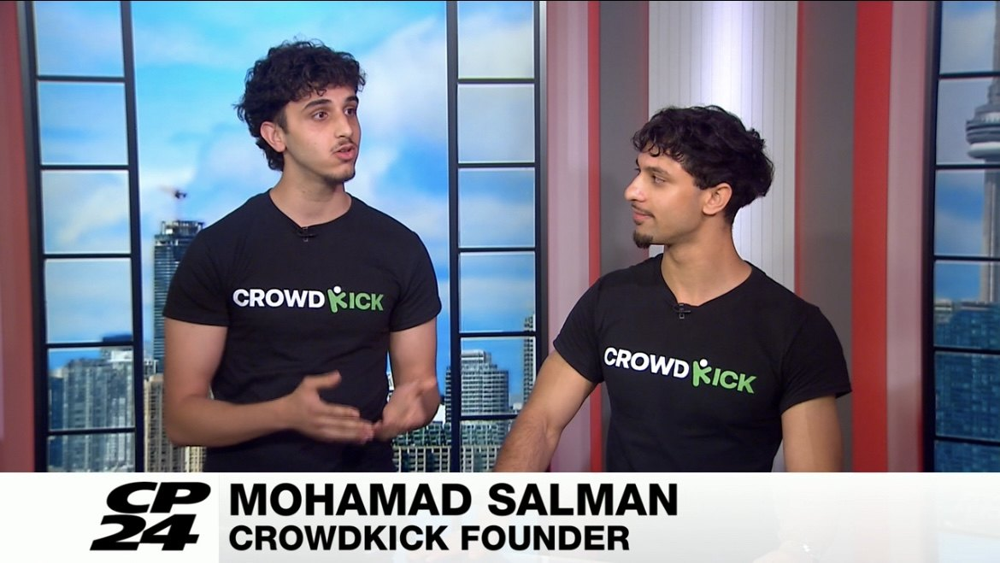

  

  
  
  
  

---

## About me in a nutshell

- **Machine learning researcher at the University of Toronto,** co-author on a paper submitting to EuCAP 2027.
- **Built an iOS app alone** that hit 10,000 users and $4,000 MRR, then demoed it live on CP24.
- **Wrote a Llama inference engine in raw CUDA** that saturates 79% of an RTX 4090's memory bus.
- **Wrote a distributed training framework** that beats NVIDIA's Megatron-LM by 37%.
- **Found a CVSS 9.1 flaw** in a 30k-star AI serving project and took it through to a CVE.

**I am going all in on machine learning.** The work I want is the layer underneath the model:
training systems, inference runtimes, and the GPU engineering that makes both fast.

   
  
   
  Live on CP24 demoing CrowdKick, one day before the World Cup.

 

# &nbsp;🔬&nbsp; Research

### Machine Learning Researcher, University of Toronto &nbsp;with Prof. Parinaz Naseri

  

- **What I work on.** Surrogate models that stand in for electromagnetic solvers on antenna metasurfaces. A structure that costs hours of solver time becomes a forward pass in milliseconds, which is what makes searching the design space feasible at all.
- **What I built.** I benchmarked Gaussian processes, random forests, and gradient boosting in scikit-learn, then built the PyTorch neural network that beat all of them, with custom early stopping and a physics-informed loss. I own the data cleaning, feature encoding, cross-validation, and reproducible training code end to end.
- **What it changed.** My study decided the team's input representation by showing one shape family needs **6 to 8 times less** simulation data for the same accuracy. I also showed that an energy-conservation shortcut the team planned to rely on would introduce up to **183 times** the label error, which changed the method before it reached the paper.
- **Where it goes.** Co-author on a paper submitting to **EuCAP 2027**, an IEEE international conference.

 

# &nbsp;🚀&nbsp; CrowdKick

### [CrowdKick](https://apps.apple.com/ca/app/crowdkick-sports-venue-finder/id6763609021) &nbsp;founder and CTO, built and shipped alone

    

- **What it is.** A real-time iOS app that tells you which bars near you are showing the game you want to watch. I designed it, built it, launched it, and still run it, by myself.
- **Why it stands out.** Ten thousand users, $4,000 in monthly recurring revenue, and 150 partner venues inside six weeks. It peaked in the **top 15 of the App Store Sports category** on organic growth alone, and CP24 put me on air to demo it to roughly 70,000 viewers.
- **The machine learning inside it.** Venue coverage comes from an NLP pipeline that uses LLMs to read Reddit posts and pull out which bar is showing which match. Every extraction is validated with Pydantic, fuzzy-matched to a real venue, and scored for confidence before it reaches a user.
- **Skills shown.** Taking a production mobile app from idea to paying users, React Native, PostgreSQL and PostGIS for geospatial queries, LLM extraction with structured validation, and `pytest` suites over synthetic data for every pipeline stage.

 

# &nbsp;⚙️&nbsp; ML Systems &amp; Infrastructure

### [llama-cuda-runtime](https://github.com/mohamadmsalman82/llama-cuda-runtime) &nbsp;a Llama-3.2-1B inference engine written from scratch

   

- **What it is.** A complete LLM inference engine in C++17 and CUDA with no PyTorch, no libtorch, and no inference library of any kind. I wrote the safetensors loader, the BPE tokenizer, the paged KV cache, and a custom kernel for every operation in the model, including grouped-query attention and RoPE. cuBLAS does the matmuls and nothing else.
- **Why it stands out.** Decoding a token means reading all 2.47 GB of weights out of HBM, so the only honest score is what fraction of the memory bus you saturate. This runtime hits 798 GB/s on an RTX 4090, which is **79.1% of the card's theoretical peak**, at 322 tokens/s. HuggingFace Transformers manages 17.7% on the same card. Every layer was validated against a PyTorch reference before any of it was timed.
- **Skills shown.** CUDA kernel engineering, GPU memory hierarchy and occupancy, roofline analysis, Nsight profiling, modern C++, and the discipline to prove numerical correctness before claiming a speedup.

 

### [dstraining](https://github.com/mohamadmsalman82/dstraining) &nbsp;every form of LLM parallelism, written on raw collectives

   

- **What it is.** Tensor, sequence, pipeline, and data parallelism for GPT-2, all implemented from first principles in about 3,500 lines. No DDP, no FSDP, no DeepSpeed, no Megatron code. Pipeline parallelism includes both 1F1B and interleaved schedules, and the trainer composes all four axes at once with selective recompute and bf16 weights on fp32 masters.
- **Why it stands out.** It races NVIDIA's own Megatron-LM on identical hardware and identical kernels, and wins by **37% on four-way pipeline parallel** and 16% on two-way data parallel. Where it loses, at two-way tensor parallel, the README publishes the number and the reason instead of hiding it. Five correctness suites prove each parallel model matches a single-process reference numerically.
- **Skills shown.** `torch.distributed` and NCCL at the collective level, 1F1B pipeline scheduling, gradient bucketing overlapped with backward, vocab-parallel cross-entropy, mixed-precision training, and debugging deadlocks across multiple communicators.

 

### [mlc-compiler](https://github.com/mohamadmsalman82/mlc-compiler) &nbsp;an ahead-of-time compiler for static-shape PyTorch inference

   

- **What it is.** It captures a model with `torch.export`, lowers it into its own graph IR, fuses elementwise and reduction chains into single Triton kernels, packs every intermediate tensor into one planned memory arena, and replays the entire schedule as a CUDA graph.
- **Why it stands out.** At batch size 1 on BERT-base it runs 5.5 times faster than eager and **3.0 times faster than `torch.compile`**. The more interesting result is that the advantage vanishes by batch 8, and the project is built around answering exactly that question: how much is specializing all the way to static-shape inference actually worth, and where does it stop paying. Every variant is checked against eager before it is timed.
- **Skills shown.** Compiler and IR design, operator fusion, Triton kernel authoring, whole-graph memory planning, CUDA graph capture, and benchmark methodology that reports the negative result.

 

# &nbsp;🧠&nbsp; Applied Machine Learning

### [physsplat](https://github.com/mohamadmsalman82/physsplat) &nbsp;a photo goes in, interactive learned 3D physics comes out &nbsp;

   

- **What it is.** One photograph of objects on a table becomes a scene you can orbit, grab, and knock over in the browser. The pipeline reconstructs the photo to 3D with TripoSR, decomposes it into rigid bodies with no supervision, and hands the result to a physics engine. One of the two engines is a graph neural network trained entirely on synthetic data with no hand-coded collision solver.
- **Why it stands out.** Every physics step runs client-side with no server in the loop, which meant exporting the GNN to ONNX and engineering around a race in ONNX Runtime's scatter operation. Eight blind review rounds went into measuring and fencing the learned model's failure modes, and the write-up is honest that the analytic solver still ships as the default.
- **Skills shown.** Graph neural networks, sim-to-real transfer, synthetic data generation, ONNX export and its sharp edges, WebGPU and three.js, and designing an evaluation loop that drives model iteration.

 

### [multi-agent-debate](https://github.com/mohamadmsalman82/multi-agent-debate) &nbsp;a fine-tuned LLaMA that replaces a GPT-4 judge

   

- **What it is.** A framework where LLM agents run structured debates, with five role-specific agents and three turn-taking protocols. Any agent can be backed by a different provider, so GPT-4 can argue against Claude while Cohere fact-checks, all behind one async interface with retries and rate-limit handling.
- **Why it stands out.** The judge is the expensive part, so I replaced it. A LoRA adapter of 4M trainable parameters on LLaMA 3.1 8B, trained on 5,000 debate transcripts at 4-bit precision with DeepSpeed ZeRO, reaches **87% agreement with GPT-4 judgements** on a held-out set and cuts serving latency by 70%. The repo carries 89 tests at 93% coverage, run against a mock provider so the suite costs nothing.
- **Skills shown.** QLoRA fine-tuning, distributed training with DeepSpeed ZeRO, 4-bit quantization, self-hosted inference deployment, async multi-provider orchestration, evaluation design, and testing an LLM system without paying per run.

 

# &nbsp;🛡️&nbsp; Also Worth a Look

| | |
|---|---|
| **AI infrastructure security** | Found and coordinated disclosure of a **CVSS 9.1** unauthenticated path traversal in [LocalAI](https://github.com/mudler/LocalAI), a 30k-star model serving project, through to a CVE. The method generalizes: track a project's security commits, then audit every sibling code path the fix did not touch. |
| **[codelangid](https://github.com/mohamadmsalman82/codelangid)** | A character-level CNN that identifies which of 10 programming languages a snippet is written in, from the characters alone. **90.6%** on a final test set of fresh repositories that was collected after every hyperparameter was frozen and evaluated exactly once, with leakage checked by exact hash and a MinHash near-duplicate sweep. |

 

# &nbsp;🧰&nbsp; Toolkit

<table width="100%">
<tr>
<td valign="top"><b>Languages</b></td>
<td>

</td>
</tr>
<tr>
<td valign="top"><b>ML &amp; GPU</b></td>
<td>

</td>
</tr>
<tr>
<td valign="top"><b>Backend &amp; Data</b></td>
<td>

</td>
</tr>
<tr>
<td valign="top"><b>Frontend</b></td>
<td>

</td>
</tr>
<tr>
<td valign="top"><b>Infra &amp; Tooling</b></td>
<td>

</td>
</tr>
</table>

 

  <b>B.A.Sc. Computer Engineering, University of Toronto</b> &nbsp;&#183;&nbsp; Minor in AI Engineering &nbsp;&#183;&nbsp; Class of 2028
    
  <a href="https://www.linkedin.com/in/msalman06"><b>Let's build something.</b></a>

